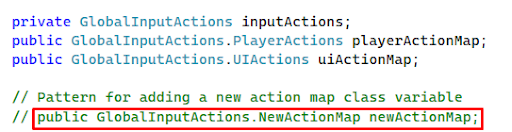

#  UniTeam Reference Guide

## Table of Contents
- [UniTeam Reference Guide](#uniteam-reference-guide)
  - [Table of Contents](#table-of-contents)
  - [Tools](#tools)
  - [Input Handling Method](#input-handling-method)
    - [Overview](#overview)
    - [Input Controller (Custom)](#input-controller-custom)
    - [How do I?](#how-do-i)
      - [Add the Input Controller to my Scene](#add-the-input-controller-to-my-scene)
      - [Reference an action in my script?](#reference-an-action-in-my-script)
      - [Add an action map to the GloablInputActions asset?](#add-an-action-map-to-the-gloablinputactions-asset)
      - [Add an action map to the InputController?](#add-an-action-map-to-the-inputcontroller)
  - [UI Method](#ui-method)

## Tools

##### Development Environment - Unity
* Editor Version 2022.3.8f1 (LTS) 

* Add WebGL Build Support Module when installing

##### Work Item Organization - Trello

Uniteam Trello Workspace [HERE](https://trello.com/invite/uniteam110/ATTIdfea28631ef499c7ebaed34a7ebcc0a505FF00CC).

##### Code Repo  - Github
Link to repo [HERE](https://github.com/RTrisler/UniTeam).

##### IDE - VS Code / Visual Studio

##### Integration Scene
* Merge all changes into IntegrationScene as a “main” branch

## Input Handling Method

### Overview
* We're using the "Actions Asset" workflow
* We're also using the C# autogenerated wrapper (so that we can reference the input actions using Intellisense instead of using strings)
* All action maps will go in a single InputActions object under "Assets/Input/GlobalInputActions”
* Here are the [docs for adding actions](https://docs.unity3d.com/Packages/com.unity.inputsystem@1.8/manual/Actions.html#creating-actions)
    * Examples in the  "Assets/Input/GlobalInputActions" file

* UI might need to be handled outside of the Input Controller (still figuring this out)

### Input Controller (Custom)
The InputController is used to:
* Enable/disable action maps
* Access action maps and their actions

When an action map is added, it needs to be added to the InputController to be accessible to the application

All input action triggers should be routed from the InputController

### How do I?
#### Add the Input Controller to my Scene
To use the input controller in a scene, add the Input Controller prefab to the scene

#### Reference an action in my script?
Use the pattern:  \
“InputController.Instance.{target action map}.{target action}.{target event}”

* Note: This should never be done in the Awake() method as the action map instances are potentially not created at that point in time. However you can use them in the Start() method

#### Add an action map to the GloablInputActions asset?
* Here are the [docs for adding actions](https://docs.unity3d.com/Packages/com.unity.inputsystem@1.8/manual/Actions.html#creating-actions). 
    * Reference “Creating Actions using the Action editor”
* All action maps should be created in the  "Assets/Input/GlobalInputActions" file

#### Add an action map to the InputController?
1. Add a public class variable of the given action map type to the InputController

2. Add the map to be disabled in the InputController.DisableAllActionMaps() method

3. Add an Enable and a Disable method for the new action map to the InputController

## UI Method
* Use the UI Builder strictly for design
* Use a custom C# script to handle events (such as button clicks & menu transitions)
* I followed this guide (it’s the only one I found that explained everything)
    * [Getting started with UI Toolkit at runtime | Unity Blog](https://blog.unity.com/engine-platform/ui-toolkit-at-runtime-get-the-breakdown)
* Set the first selected item using this method
    * [https://docs.unity3d.com/Manual/UIE-faq-event-and-input-system.html#enter-keyboard](https://docs.unity3d.com/Manual/UIE-faq-event-and-input-system.html#enter-keyboard)
    * And in the UI Builder, give whatever element you’d like the “first-focused” class (located in “GlobalStyleSheet.uss”)